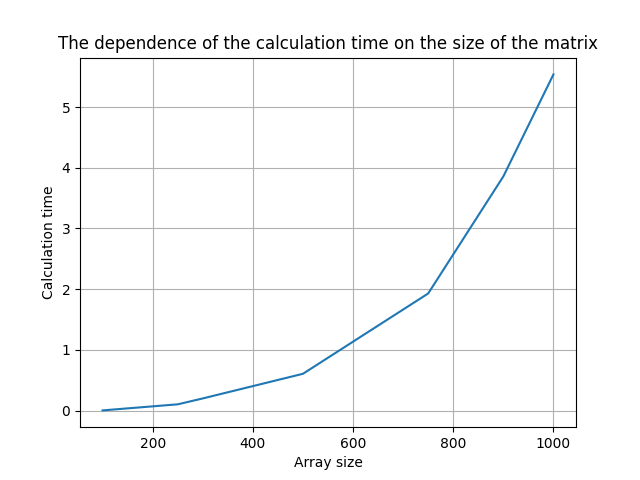

# Описание к лабораторным работам
### Лабораторная 1
***Выполнил студент группы 6312-100503D Пахомов Леонид***
___

### Задание на *л/р*:

- [X] Написать на С++ программу, которая создает матрицы, умножает их и записывает результаты в файлы
- [X] Написать программу на Python, которая проверяет результат перемножений матриц на C++
- [X] Получить график зависимости времени вычислений от размеров матриц

### Описание файлов
+ data - папка со значениями матриц
+ results - папка с результатами вычислений
  + result_computing - папка с временем вычислений и размером для каждой матрицы
  + result-matrix - папка с результирующей матрицей (результат перемножения двух матриц)
+ main.cpp - С++ скрипт, который создает, перемножает и записывает матрицы и результаты в файл
+ calc_checking.py - Python утилита для проверки перемножения матриц на C++
+ main.py - Python скрипт для проверки результатов C++ программы, использует calc_cheking.py (Для этого используется библиотека Numpy)
+ checking calculations.txt - txt файл, куда main.py записывает, верно ли были перемножены матрицы в C++
+ graph.png - График зависимости времени перемножения матриц от их размера
___

### График зависимости:
